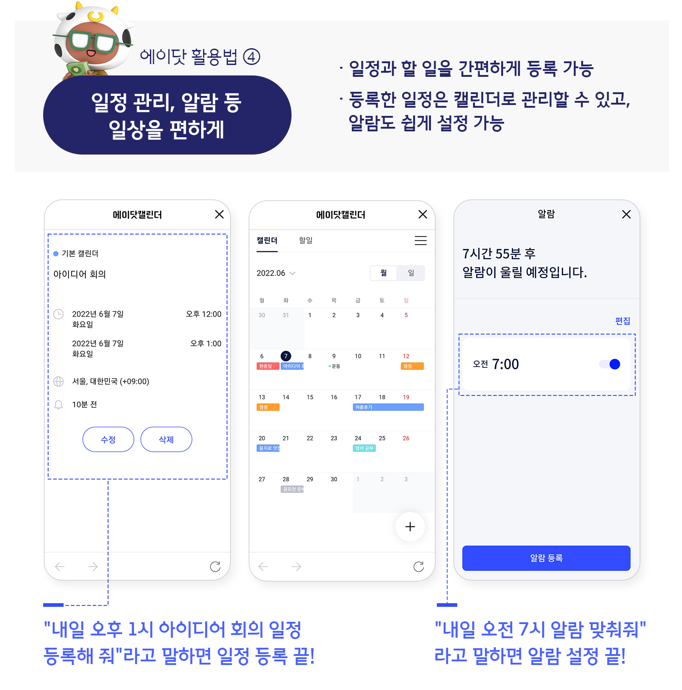
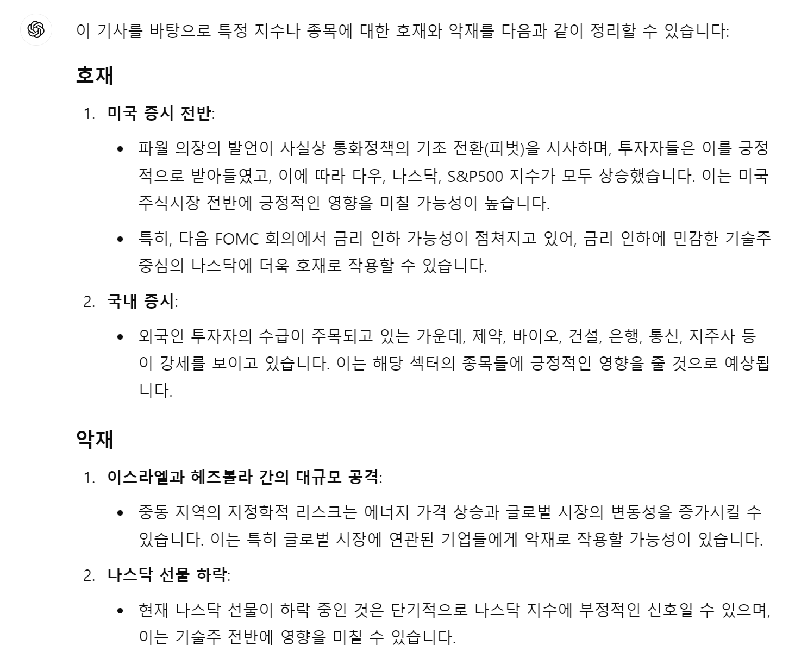
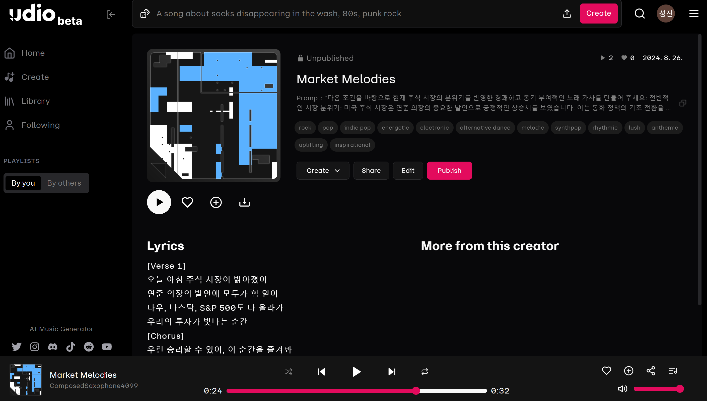
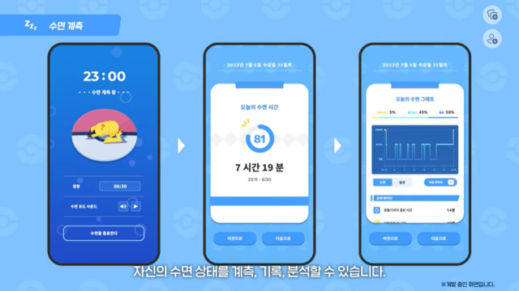
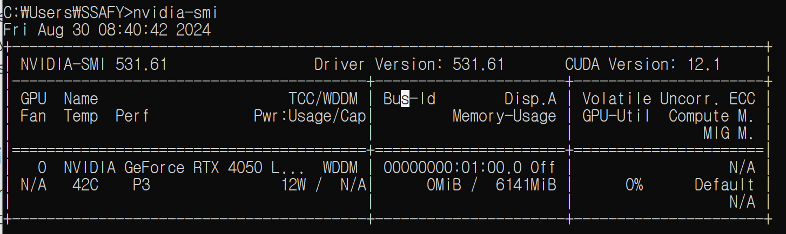
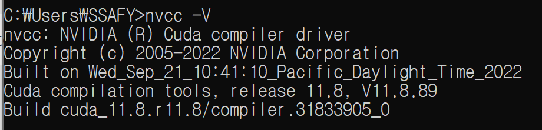

## 🐢 배성진

- 개요: 특화 PJT 부트캠프 기간과 특화 PJT 1주차(Sub-PJT Ⅰ) 기간 수행한 작업과 내용들을 정리했습니다.
- 기간: 24.08.19 ~ 24.08.30
- ~~특화 도메인 변경(핀테크 -> 인공지능 음성)으로 미니특강은 핀테크로 진행했습니다.~~

<br>

## 기획 아이디어

특화 PJT 1주차 기간 팀과 회의하며 제가 주로 참여하고, 발전하려 했던 아이디어 및 자료들을 정리했습니다.

### 전화 내용 기반 일정 등록 어플

- 전화 속 음성을 활용해 일정을 자동으로 등록해주는 어플리케이션 아이디어를 기획하고, 팀원들과 공유했습니다.

- 'SKT 에이닷'의 AI 통화요약과 일정 등록 기능을 결합해 실시간 음성 기반 일정 관리 자동화를 목표로 했습니다.

  

- 구상한 메인 기능은 다음과 같습니다:

  - 실시간 음성 인식을 통한 일정 자동 등록 기능

  - 인식된 내용을 기반으로 인원 및 장소 확인

  - 교통/가는 길 지원 서비스

### 아침 금융 기상 어플

- 팀원 `홍주형`의 아이디어로 시작된 기획으로 금융 게이미피케이션 기능으로 건강한 아침 생활을 지원하는 서비스입니다.
- 해당 서비스에서 생성형 AI와 음성 AI의 활용 가능성을 판단하고자 다음과 같은 업무를 수행했습니다.

  1. **생성형 AI를 활용한 경제 기사 뉴스 요약(호재, 악재)**

     경제 뉴스 사이트에서 예시 경제 기사를 정리해서 LLM(ChatGPT)에 특정 종목이나 지수에 긍정적/부정적 영향을 끼쳤는지 추론하도록 프롬포트를 입력했습니다.

     - 입력 프롬포트:
       ```
         너는 주가 분석 전문가야. 아래의 정리된 뉴스를 읽고, 이 기사가 특정 지수나 종목에 호재인지 악재인지 판단해서 정리해줘.
       ```
     - 결과:

       

  2. **요약된 정보를 바탕으로 노래 생성 AI를 활용**

     매일 아침 달라지는 기상 알람 노래 예시를 위해 위에서 요약된 정보를 바탕으로 프롬포트를 작성했고, 생성형 AI 음악 생성 사이트 udio에서 음악을 생성했습니다.

     - 입력 프롬포트:

       ```
         "다음 조건을 바탕으로 현재 주식 시장의 분위기를 반영한 경쾌하고 동기 부여적인 노래 가사를 만들어 주세요:
         전반적인 시장 분위기: 미국 주식 시장은 연준 의장의 중요한 발언으로 긍정적인 상승세를 보였습니다. 이는 통화 정책의 기조 전환을 시사하며, 다우, 나스닥, S&P 500 등의 주요 지수가 상승했습니다. 하지만 중동 지역의 지정학적 긴장과 나스닥 선물의 소폭 하락으로 약간의 우려가 존재합니다.
         섹터별 분위기: 제약, 바이오, 건설, 은행, 통신, 지주사 등의 섹터가 최근 강세를 보이고 있으니, 이러한 섹터의 강점을 강조해주세요.

         혼재된 신호: 전반적으로 긍정적인 분위기이지만, 지정학적 불확실성과 나스닥 선물의 하락에 따른 잠재적 위험에 대해 간략히 언급해 주세요.

         가사의 구조는 긍정적인 노트로 시작해 시장의 상승세를 축하하고, 잠재적 위험을 간단히 언급한 후, 하루를 자신감 있게 시작할 수 있도록 격려하는 내용으로 마무리해 주세요.

         가사의 톤은 에너제틱하고 영감을 주는 분위기로, 듣는 사람들이 자신감을 가지고 하루를 시작할 수 있도록 리듬감 있는 스타일로 만들어 주세요."
       ```

     - 결과:

       

  - **기대효과**:

    - 매일 같은 음악이 반복되고 익숙해지면 잠결에 알람을 듣지 못하게 될 수 있습니다. 따라서 알람 음을 자주 바꿔 항상 낯선 상태를 유지하는 것이 기상에 도움이 될 것이라 기대했습니다.

    - 생성형 AI를 활용한 금융 알람 생성 기능으로 사용자는 매일 다른 음악으로 알람을 듣을 수 있고, 금융 정보를 제공받으며 기상할 수 있습니다.

### 수면 비서

- 수면에 초점을 맞춰 사용자의 수면을 돕는 수면 사운드, 수면 데이터를 활용한 수면 분석 기능을 제공하는 아이디어를 구상했습니다.
- 실제 사용 중인 수면 상태 측정, 기록, 분석 어플리케이션 '포켓몬 슬립'을 기반으로 아이디어를 구체화했습니다.

  

- 구상한 메인 기능은 다음과 같습니다:

  - 수면 데이터를 활용한 수면 분석 기능 제공

  - 음성 제어를 통한 수면 사운드 생성 및 플레이

  - 기상 미션을 통한 재화 획득, 재화를 통한 음악 생성

<br>

> 팀 회의를 거쳐 최종 선정된 기획은 "기상 관련 서비스를 제공하는 나만의 비서"입니다.

<br>

## 음성 AI

인공지능(음성) 도메인 명세서 학습과 음성 AI 활용을 위한 데이터 탐색 과정을 정리했습니다.

### GPU 활용을 위한 CUDA, CuDNN 세팅

- 향후 사용할 딥러닝 모델의 실행 속도를 높이기 위한 GPU 사용을 위해 다음과 같은 작업을 수행했습니다.

  1. NVIDIA 사이트에서 환경에 맞는 CUDA를 설치(11.8, 12.1)합니다.

  2. CUDA와 호환되는 cuDNN 파일을 다운로드받고, 라이브러리 경로를 추가합니다.

  3. `nvidia-smi` 명령어로 GPU 환경 세팅이 완료되었는지 확인합니다.

     

     

  > 참고: 저는 리눅스 환경의 VSCode 개발을 위해 WSL2 Ubuntu 20.04를 설치하고, VSCode에 connect해 환경을 추가 세팅했습니다.

### AI 허브 데이터 탐색

- AI 허브는 AI 기술 및 제품·서비스 개발에 필요한 AI 인프라(AI 데이터, AI SW API, 컴퓨팅 자원)를 지원함으로써 누구나 활용하고 참여하는 AI 통합 플랫폼입니다.

  

- AI 허브의 사용자를 위해 개발 및 활용을 위한 인프라 서비스와 AI 활성화를 위한 서비스를 제공하고 있습니다.

- 음성 데이터 학습 및 활용 방안을 구체화하고자 AI 허브의 데이터를 탐색했습니다. 주요 탐색한 데이터들은 다음과 같습니다:
  - [감정이 태깅된 자유대화 (성인)](https://www.aihub.or.kr/aihubdata/data/view.do?currMenu=115&topMenu=100&aihubDataSe=data&dataSetSn=71631)
    - 구축년도 : 2022 갱신년월 : 2023-12 다운로드 : 633 용량 : 302.96 GB
  - [뉴스 대본 및 앵커 음성 데이터](https://www.aihub.or.kr/aihubdata/data/view.do?currMenu=115&topMenu=100&aihubDataSe=data&dataSetSn=71557)
    - 구축년도 : 2022 갱신년월 : 2023-11 다운로드 : 477 용량 : 227.82 GB
  - [자연어 분석 후처리용 과교정 검증 데이터](https://www.aihub.or.kr/aihubdata/data/view.do?currMenu=115&topMenu=100&aihubDataSe=data&dataSetSn=71477)
    - 구축년도 : 2022 갱신년월 : 2024-04 다운로드 : 478 용량 : 112.29 GB
  - [명령어 인식을 위한 소음 환경 데이터](https://www.aihub.or.kr/aihubdata/data/view.do?currMenu=115&topMenu=100&aihubDataSe=data&dataSetSn=71405)
    - 구축년도 : 2022 갱신년월 : 2024-01 다운로드 : 638 용량 : 677.38 GB
  - [감성 및 발화스타일 동시 고려 음성합성 데이터](https://www.aihub.or.kr/aihubdata/data/view.do?currMenu=115&topMenu=100&aihubDataSe=data&dataSetSn=71349)
    - 구축년도 : 2022 갱신년월 : 2024-05 다운로드 : 2,926 용량 : 219.29 GB
  - [일반상식 문장 생성 데이터](https://www.aihub.or.kr/aihubdata/data/view.do?currMenu=115&topMenu=100&aihubDataSe=data&dataSetSn=71309)
    - 구축년도 : 2022 갱신년월 : 2023-12 다운로드 : 249 용량 : 242.96 MB
