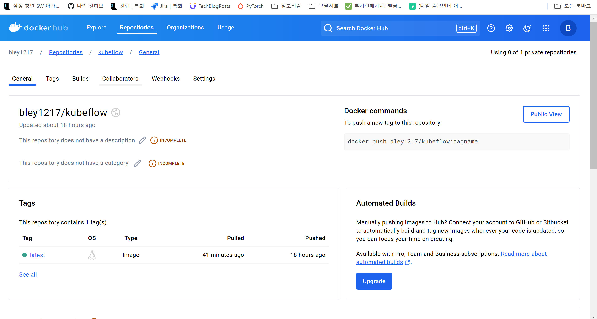
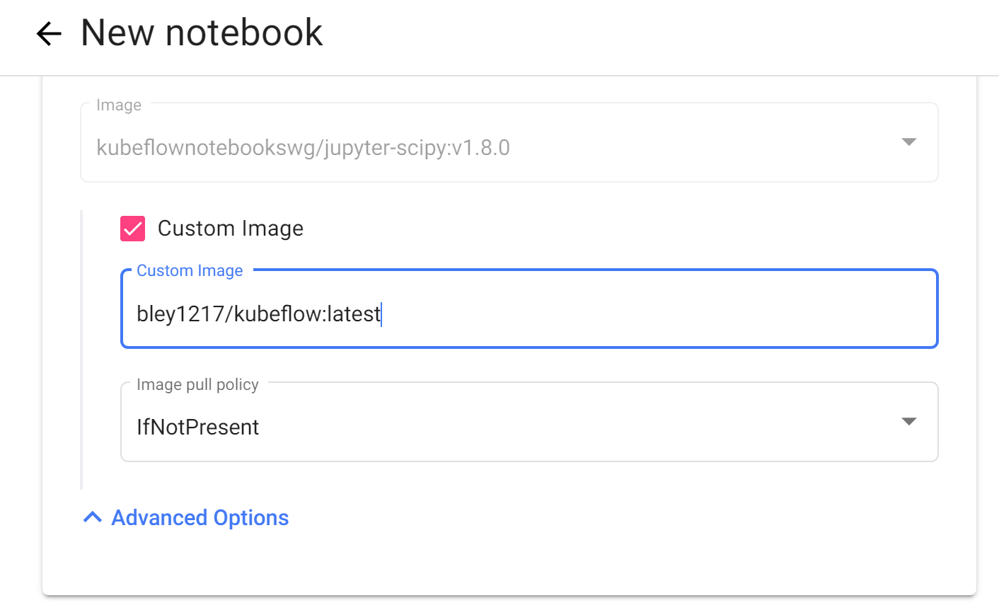
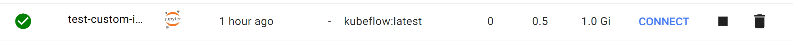

# jupyter-nb-image 생성

친절한 Tutorial과 설명이 [Kubeflow - Custom Images](https://www.kubeflow.org/docs/components/notebooks/container-images/)에 있음

Image는 다음과 같은 사항을 만족해야 함

- expose an HTTP interface on port 8888:
  - kubeflow sets an environment variable NB_PREFIX at runtime with the URL path we expect the container be listening under
  - kubeflow uses IFrames, so ensure your application sets Access-Control-Allow-Origin: \* in HTTP response headers
- run as a user called jovyan:
  - the home directory of jovyan should be /home/jovyan
  - the UID of jovyan should be 1000
- start successfully with an empty PVC mounted at /home/jovyan:
  - kubeflow mounts a PVC at /home/jovyan to keep state across Pod restarts

notebook terminal에서 sudo가 안먹어서 새로운 이미지 만들어서 도커 띄워야함

## 문제

docker image를 풀 해오지 못하고, jupyter notebook 컨테이너를 생성하지 못하는 문제가 있었다.

```
ErrImagePull: failed to pull and unpack image "docker.io/library/jupyter_nb_pytorch:1.5.0": failed to resolve reference "docker.io/library/jupyter_nb_pytorch:1.5.0": pull access denied, repository does not exist or may require authorization: server message: insufficient_scope: authorization failed
```

해당 문제를 구글링해보면, 대부분 이름을 잘못 쳤다는 말이 많아서 눈을 비벼 가며 스펠링을 확인했지만 잘못된 것은 없어 보였다.

같은 클러스터 내에서 빌드된 이미지를 이용해 docker run을 돌리면 잘만 돌아가는데 왜 kubeflow에서는 접근을 못할까 고민하던 중,

Docker hub에 이미지를 레포를 만들고, 내 커스텀 이미지를 푸시한 다음 해당 주소로 접속하는 방법을 생각해냈다.

## 해결 과정

Docker hub 회원 가입을 하고, Ubuntu에서 로그인을 한다.

```r

docker login -u bley1217

docker build --t bley1217/kubeflow .

docker push bley1217/kubeflow

```

이미지를 만들고, 푸시한다.



도커 허브에 잘 올라갔다.

### Notebook 생성



제대로 스펠링을 적는다. 그러나,,

#### **여전히 에러가 생긴다..!**

그 뒤로는 기반 이미지를 바꿔보고, (`public.ecr.aws/j1r0q0g6/notebooks/notebook-servers` 에서 `kubeflownotebookswg` 주소로 변경)

[kubeflow 홈페이지](https://www.kubeflow.org/docs/components/notebooks/container-images/)에서 시키는 대로 Dockerfile을 수정해나갔다. 그 과정에서 Notebook 설정을 추가하고 환경변수들을 저장했다. 그 결과물이 동 폴더 내에 있는 Dockerfile이다.
후에 python 패키지나, linux 패키지들을 설치해 놓을 수도 있다는 것을 알았다.

또한, 매번 이미지를 입력하는 것이 번거롭다면, [마켓컬리의 kubeflow 적용기 글](https://helloworld.kurly.com/blog/second-mlops/)에 나와 있듯이

`apps/jupyter/jupyter-web-app/upstream/base/configs/spawner_ui_config.yaml` 파일을 수정하고 주피터 노트북을 재배포 하면 드롭다운 메뉴에 생겨난다.

```r

kustomize build apps/jupyter/jupyter-web-app/upstream/overlays/istio | kubectl apply -f -

```

사실 여기까지도 에러는 해결되지 않고 있었다. ImagePullBackOff에러의 근원을 찾고자 kubelet의 log를 찾아 들어갔다.

```r
sudo journalctl -u kubelet | tail -20 # 끝에서 20개만 보기
```

이제야 실마리를 찾을 수 있었다.

```r
Sep 06 08:01:22 DESKTOP-MMCQPV1 kubelet[1060]: E0906 08:01:22.198752    1060 remote_image.go:180] "PullImage from image service failed" err="rpc error: code = Unknown desc = failed to pull and unpack image \"docker.io/library/jupyter_nb_pytorch:1.8.0\": failed to resolve reference \"docker.io/library/jupyter_nb_pytorch:1.8.0\": failed to do request: Head \"https://registry-1.docker.io/v2/library/jupyter_nb_pytorch/manifests/1.8.0\": dial tcp: lookup registry-1.docker.io on 172.26.32.1:53: read udp 172.26.42.180:41383->172.26.32.1:53: i/o timeout" image="jupyter_nb_pytorch:1.8.0"
```

`172.26.42.180:41383->172.26.32.1:53: i/o timeout` 이 핵심이었다.

결국 외부와 클러스터가 소통을 못하고 있단 뜻이었고, kubeflow 가 아니라 WSL, Ubuntu의 네트워크, DNS 문제라는 것을 알았다.

### 진짜 해결

- 우선, 권한 설정 관련 메시지를 많이 보았다 보니 docker hub 레포를 private 에서 public 으로 변경했다.
- private 레포일 경우 kubernetes secret을 설정해주어야 한다.

```r
kubectl get pods -n kube-system -l k8s-app=kube-dns

>>>
NAME                       READY   STATUS    RESTARTS      AGE
coredns-76f75df574-p4t8c   1/1     Running   0             52m
coredns-76f75df574-w99mp   1/1     Running   1 (53m ago)   25h
>>>

# coredns 는 문제가 없어 보인다.

curl https://registry-1.docker.io/v2/

>>> curl: (6) Could not resolve host: registry-1.docker.io
```

역시 curl을 때렸을 때 못찾고 있었다. 따라서, `/etc/resolv.conf` 파일을 수정한다.

```r
# This file was automatically generated by WSL. To stop automatic generation of this file, add the following entry to /etc/wsl.conf:
# [network]
# generateResolvConf = false
nameserver 172.26.32.1
```

여기에

```r
nameserver 8.8.8.8  # Google DNS
nameserver 8.8.4.4  # Google DNS
```

을 추가한다.

혹시 모르니 docker login을 다시하고, kubeflow에서 notebook을 생성하니 잘 생성되었다.



## 또 다른 문제


노트북이 생성은 됐는데, 들어가지지 않는다..

### 해결

```r
[I 2024-09-07 05:30:47.346 ServerApp] The port 8888 is already in use, trying another port.
[I 2024-09-07 05:30:47.346 ServerApp] Serving notebooks from local directory: /home/jovyan
[I 2024-09-07 05:30:47.346 ServerApp] Jupyter Server 2.9.1 is running at:
[I 2024-09-07 05:30:47.346 ServerApp] http://test-custom-image-0:8889/notebook/dohyung/test-custom-image/lab
[I 2024-09-07 05:30:47.346 ServerApp]     http://127.0.0.1:8889/notebook/dohyung/test-custom-image/lab
```

왜 때문인지 모르겠지만 8888 포트가 사용중이어서 8889 포트로 jupytor notebook이 열리고 있었다는 것을 알았다.

Dockerfile에서 8889 포트를 열어주고,

```r
EXPOSE 8889
```

kubectl로 포트포워딩 해주면

```r
kubectl port-forward --address=0.0.0.0 pod/test-custom-image-0 -n dohyung 8080:8889
```

`http://localhost:8080/notebook/dohyung/test-custom-image/` 의 주소로 notebook에 접속할 수 있다.
(https 가 아닌 http 임에 주의하자.)

[seokii의 블로그](https://seokii.tistory.com/221#%EC%BB%A4%EC%8A%A4%ED%85%80_%EC%9D%B4%EB%AF%B8%EC%A7%80_%EC%84%9C%EB%B2%84_%EC%83%9D%EC%84%B1%EA%B3%BC_%EC%98%A4%EB%A5%98_%ED%95%B4%EA%B2%B0) 에 보면 노트북을 재생성하면 에러가 사라졌다고 하는데, 나는 사라지지 않는다..
