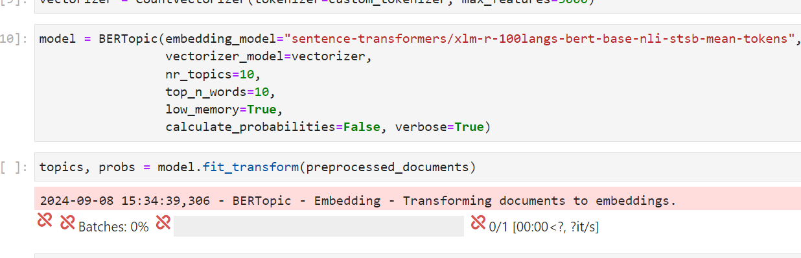

# Jupyter-notebook-kernel 문제

[KoBertopic 모델](https://github.com/ukairia777/KoBERTopic?tab=readme-ov-file) 을 프로젝트에 적용하기 위해 실험하던 중

모델의 `.fit_transform` 단계에서 계속해서 jupyter notebook 의 kernel이 죽고, 다시 실행되는 문제가 발생했다.

모델의 `verbose=True` 옵션을 추가해 돌려보면,



와 같이, Batch가 돌아갈 때만 되면 커널이 죽는다. 분명 메모리 문제인 것 같아서, Kubeflow에서 노트북을 생성할 때 메모리를 최대한 많이 주려고 했는데, 4Gi 부터는 더 이상 줄 수 없다고 떠서 어쩔 수 없이 3Gi의 메모리를 할당 할 수 밖에 없었다.

또한 Dockerfile의

```r
--NotebookApp.max_buffer_size=100000000000000000000000000000000000000000000000000000000000000000000000000000
```

옵션도 추가해서 마지막에 커맨드를 실행시켜 주었다.

용량을 늘릴 때마다 조금씩 진행도가 증가하고 있는 것을 보면 메모리 문제는 맞는 것 같은데, 어떻게 해결할지를 모르겠다. GPU를 할당은 하고 있는데 쓰지 못하고 있는데, 그쪽으로 해결해야 할 지.. 고민이다.
