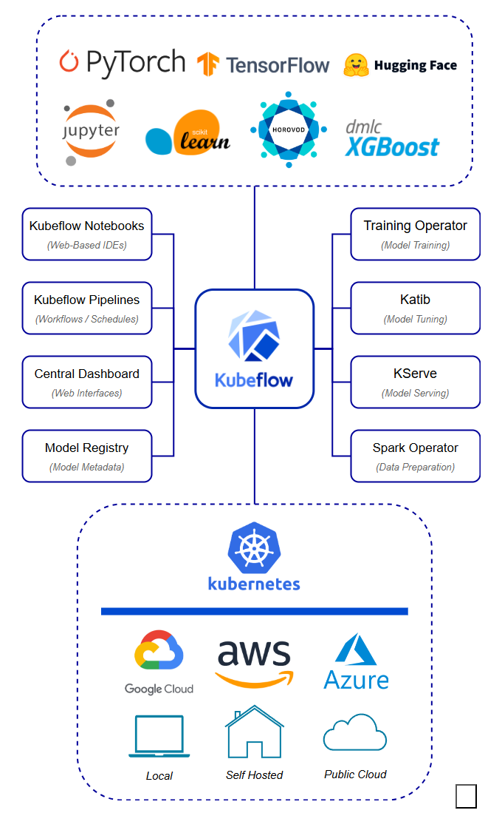

# Kubeflow

> 큐브플로우

kubernetes 위에서 작동하는 AI 플랫폼이다. 단순 프레임워크라 칭하기에는 너무 많은 것들을 지원하다보니 그런 이름이 붙은게 아닌가 싶다.

[Kubeflow Introduction]: (https://www.kubeflow.org/docs/started/introduction/)
[KServing의 존재 이유]: (https://devocean.sk.com/blog/techBoardDetail.do?ID=163645)
[NVIDIA Triton Inference Server를 쿠버네티스에 배포하고 GPU 병렬 사용을 테스트 한 후기 (Kubernetes Kubeflow KFServing)]: (https://schulwin.tistory.com/entry/NVIDIA-Triton-Inference-Server%EB%A5%BC-%EC%BF%A0%EB%B2%84%EB%84%A4%ED%8B%B0%EC%8A%A4%EC%97%90-%EB%B0%B0%ED%8F%AC%ED%95%98%EA%B3%A0-GPU-%EB%B3%91%EB%A0%AC-%EC%82%AC%EC%9A%A9%EC%9D%84-%ED%85%8C%EC%8A%A4%ED%8A%B8-%ED%95%9C-%ED%9B%84%EA%B8%B0-Kubernetes-Kubeflow-KFServing)

대시보드에서 쥬피터 노트북을 생성할 수 있다.

`Katib`에서는 파라미터 검색을, `Kserve`에서는 모델 서빙을 할 수 있다. [NVIDIA Triton Inference Server를 쿠버네티스에 배포하고 GPU 병렬 사용을 테스트 한 후기 (Kubernetes Kubeflow KFServing)]에서는 한 번에 하나의 gpu만을 사용하는 시스템 내에서 효율적으로 gpu를 사용하기 위해서 Triton을 사용했다.

다양한 클러스터와 Pod, 컨테이너등의 개념이 많이 등장해서 Docker와 kubernetes에 대한 기본 개념을 얻고나서 다시 돌아오기로 한다. (24.08.12)
