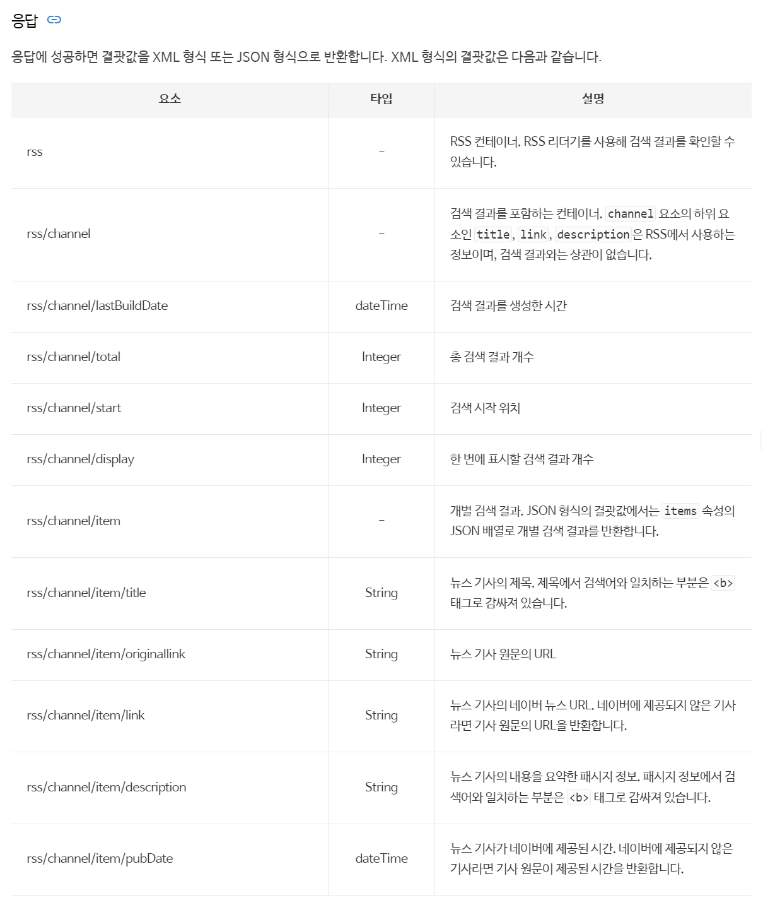
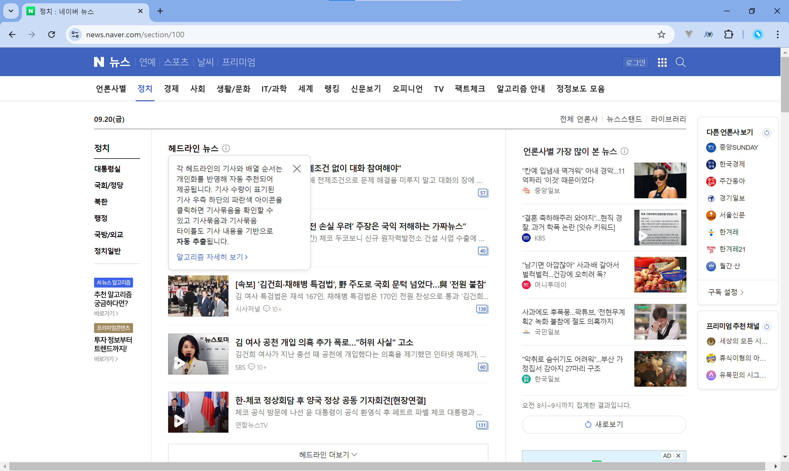

# 네이버 뉴스 크롤링

- 개요: [네이버 뉴스 홈](https://news.naver.com/) 내 섹션별 크롤링을 원하는 시간 전(ex: 1시간전, 2시간전 등)까지 수행하는 코드입니다.
- 작성날짜: 2024.09.20
- 작성자: 배성진

## 주요 폴더 구조

```
📦news_crawling
 ┣ 📂crawling
 ┣ 📂data
 ┃ ┣ 📂100
 ┃ ┃ ┗ 📜2024-09-20_09.pkl
 ┃ ┣ 📂101
 ┃ ┃ ┗ 📜2024-09-20_09.pkl
 ┃ ┣ 📂102
 ┃ ┃ ┗ 📜2024-09-20_09.pkl
 ┃ ┣ 📂103
 ┃ ┃ ┗ 📜2024-09-20_09.pkl
 ┃ ┣ 📂104
 ┃ ┃ ┗ 📜2024-09-20_09.pkl
 ┃ ┗ 📂105
 ┃ ┃ ┗ 📜2024-09-20_09.pkl
 ┣ 📜crawler.py
 ┣ 📜load_test.py
 ┣ 📜main.py
 ┣ 📜naver_news_crawling.ipynb
 ┣ 📜parser.py
 ┣ 📜utils.py
 ┗ 📜requirements.txt
```

- 향후 데이터 수집과 활용에 따라 폴더 구조 변경 및 파일명 변경이 이뤄질 수 있습니다.

## 프로젝트 설명

- 수면 후 기상한 사용자들에게 아침 브리핑을 제공하기 위한 뉴스 데이터를 수집하고자 시간별 뉴스 크롤링을 수행했습니다.

- 이에 따라 프로젝트 초기에 네이버 뉴스 API를 활용하고자 했으나, 해당 API 응답 결과에는 각 뉴스의 본문 내용이 포함되지 않고, 뉴스 기사의 내용을 요약한 패시지 정보인 description만 제공받을 수 있음을 확인했습니다.

    

  > 출처: [네이버 뉴스 API](https://developers.naver.com/docs/serviceapi/search/news/news.md)

- 브리핑 생성의 정확성을 높이고, 내용의 풍부함을 위해 본문을 크롤링하고자 했고, 이에 웹 페이지의 정보를 쉽게 스크랩할 수 있도록 기능을 제공하는 라이브러리인 `BeautifulSoup4`과 HTTP 요청을 보낼 수 있는 `Request` 라이브러리를 활용해 본문 내용을 크롤링할 수 있도록 구현했습니다.

## 주요 기능 설명

- **📜 naver_news_crawling.ipynb**
  - 해당 파일의 경우, Jupyter Notebook 환경에서 크롤링 코드를 수행하고자 작성한 파일입니다.
  - 해당 파일을 기준으로 `.py` 파일들로 각 기능을 모듈화시켜 `python` 명령어로 크롤링을 수행할 수 있도록 프로젝트를 구성했습니다.
- **📜 main.py**

  - `main` 함수

    - 메인 함수는 정보를 수집하고자 하는 **목표 시간**과 **섹션 번호**를 설정할 수 있습니다.
    - 현재 날짜 기준으로 네이버 뉴스 홈의 카테고리별 뉴스 탭은 `https://news.naver.com/section/[섹션번호]`의 url로 구성됩니다.
    - 각 카테고리별로 정치: 100, 경제: 101, 사회: 102, 생활/문화: 103, 세계: 104, IT/과학: 105의 섹션번호로 구성됩니다.
    - 현재 코드 기준으로 1시간전의 뉴스 기사와 모든 섹션(100, 101, 102, 103, 104, 105)의 기사를 수집하는 것이 기본값으로 주어져 크롤링이 실행됩니다.

  - `save_articles_pickle`
    - `crawler.py` 파일 내의 함수를 통해 기사들이 수집되고, 해당 수집된 데이터를 향후 브리핑 생성 및 음악 생성에 활용하고자 `.pkl` 파일 형태로 저장하는 함수입니다.
    - 각 섹션 번호에 맞게 `data/[섹션번호]` 폴더 아래 `[YYYY-MM-DD_HH]` 형식으로 저장됩니다.
    - 이 때 수행한 시각을 기준으로 파일명에 포함되어 저장됩니다.(예시: 10:38에 크롤링 실시한다면, YYYY-MM-DD_10.pkl로 저장)

- **📜 crawler.py**

  - `crawl_news_articles` 함수
    - `BeautifulSoup`, `requests` 라이브러리를 활용한 데이터 수집을 실행하는 함수입니다.
    - 각 섹션별 원하는 시간대에 맞는 모든 뉴스를 수집하고, 본문 내용을 저장하기 위해 요청과 응답을 보냅니다.
    - 아래 사진과 같이 네이버뉴스에는 개인화를 반영해 자동 추천되어 제공되는 헤드라인 뉴스가 존재하므로, 특정 사용자에 종속되지 않은 뉴스 기사를 시간 순대로 크롤링하기 위해 `section_latest_article` class를 지닌 HTML 태그에 접근했습니다.
      
    - 원하는 시간대까지 접근하고자 `next_cursor`값을 갱신하며, `기사 더보기` 버튼을 누르는 기능을 구현했습니다.
